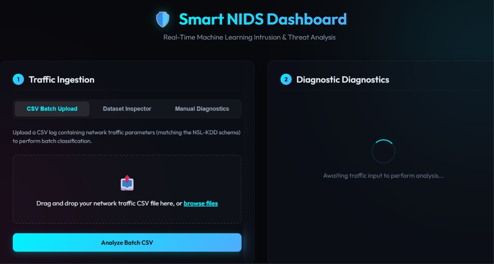
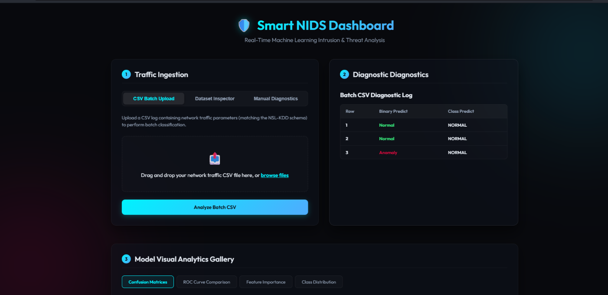
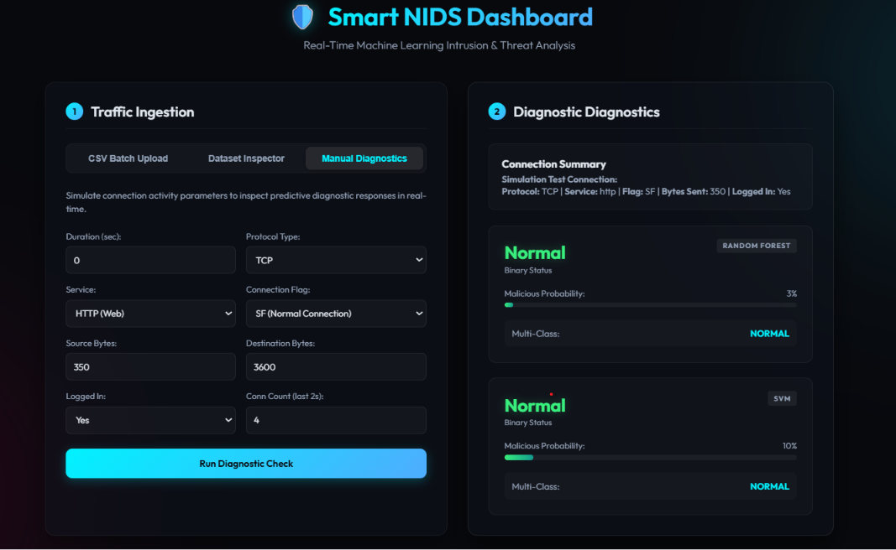
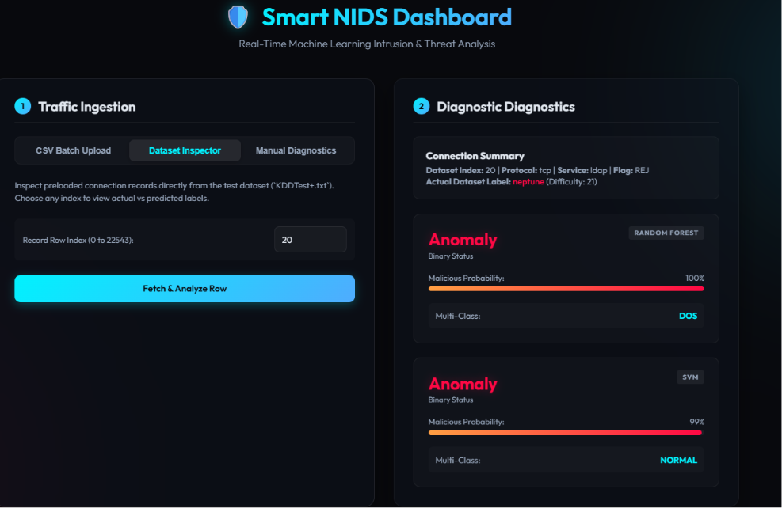
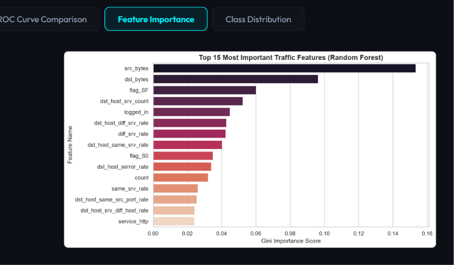

# Smart Network Intrusion Detection System (NIDS)
A Machine Learning-powered Network Intrusion Detection System (NIDS) trained on the **NSL-KDD** dataset. The system features preprocessing, evaluation analytics, a command-line interface (CLI) diagnostic tool, and an interactive dark-themed web dashboard.
---
##  Features
- **Binary Classification:** Classify connection traffic as `Normal` or `Anomaly` (threat).
- **Multi-class Classification:** Categorize attacks into 5 distinct classes: `Normal`, `DoS` (Denial of Service), `Probe` (Port scanning/probing), `R2L` (Remote-to-Local unauthorized access), and `U2R` (User-to-Root privilege escalation).
- **Dual Classifiers:** Employs both **Random Forest** (high accuracy) and **Support Vector Machine (SVM)** models.
- **Diagnostics CLI:** Run immediate threat diagnostics on specific test set indexes or mock HTTP traffic.
- **Glassmorphic Web Dashboard:** Interactive web user interface with batch CSV log uploading, live dataset inspector, and visual evaluation graph galleries.
---
##  Screenshots
 ## 📸 Dashboard Overview
  

- **Real-time Traffic Ingestion**
  
  
- **Manual Diagnostics**
  

- **Dataset Inspector**
  

- **Feature Analysis**
  


 ##  How It Works (ML Pipeline Flow)
The system uses a fully local, step-by-step machine learning pipeline for network intrusion detection. The backend does all training and evaluation offline, meaning no data is sent to any external server.

**Data Ingestion**: When you run `utils.py`, the client downloads the official NSL-KDD train and test datasets directly from the UNB repository. The raw `.txt` files are parsed and loaded into pandas DataFrames.

**Preprocessing**: `preprocess.py` handles all feature engineering. It normalizes numerical features with MinMaxScaler, encodes categorical features like `protocol_type` and `service` with LabelEncoder, maps attack labels to `0=Normal, 1=Attack`, and saves the fitted scalers/encoders to disk for reuse.

**Training**: `train.py` loads the processed data and trains 2 separate models:
1. **Random Forest Classifier** - for overall intrusion detection
2. **SVM Classifier** - for comparison and benchmarking
Both models are saved as `.pkl` files after training with 5-fold cross-validation.

**Evaluation & Visualization**: `visualize.py` evaluates the trained models on the test set. It prints classification reports, accuracy, precision, recall, F1-score, and exports visual analytics:
- **Confusion Matrix**
- **ROC Curve & AUC**
- **Feature Importance Plot**

**Output**: All results, metrics, and plots are saved to the `/outputs` folder. You can inspect them directly or use the `Dataset Inspector` and `Feature Analysis` modules to explore the data further.

**Note**: All pipeline logs including data shapes, training time, accuracy scores, and feature stats print directly to the terminal so you can verify each step of the ML flow.

##  Project Structure
`utils.py`       - Downloads and parses NSL-KDD datasets  
`preprocess.py`  - Normalizes features, encodes categories, saves scalers  
`train.py`       - Trains Random Forest and SVM models  
`visualize.py`   - Evaluates models and saves plots + metrics  
`requirements.txt` - All Python dependencies  

`datasets/`      - Raw NSL-KDD train/test files  
`outputs/`       - Generated plots, reports, and results  
`screenshots/`   - UI images for README

##  Running the Pipeline Step-by-Step

**Step 1: Download the Datasets**  
Downloads the official NSL-KDD train and test datasets from the UNB repository:
```powershell
python utils.py
```
### Step 2: Preprocess the Features
Normalizes numerical scales, encodes categorical features, maps labels, and saves parameters:
```powershell
python preprocess.py
```
### Step 3: Train the Models
Trains Random Forest models (on the full dataset) and SVM classifiers (on a stratified subset):
```powershell
python train.py
```
### Step 4: Export Visual Analytics
Evaluates test accuracy, prints metric reports, and saves performance curves:
```powershell
python visualize.py
```


##  Running the NIDS Interfaces
### 1. The Command-Line Interface (CLI)
Diagnose live or saved traffic connection logs:
- **Demonstration check (Standard HTTP):**
  ```powershell
  python detect.py
  ```
- **Test Set inspector (Specify index row, e.g., index 20):**
  ```powershell
  python detect.py --index 20
  ```
### 2. The Interactive Web Dashboard
Launches a responsive local Flask dashboard server:
```powershell
python app.py
```
Open your browser and navigate to: **`http://127.0.0.1:5000/`**
---
##  Summary of Model Performance

### Binary Status (Anomaly vs Normal)

| Model | Test Accuracy | Precision (Anomaly) | Recall (Anomaly) | F1-Score (Anomaly) |
| :--- | :---: | :---: | :---: | :---: |
| **Random Forest** | 77.0% | 97.0% | 61.0% | 75.0% |
| **SVM (stratified)** | 78.0% | 97.0% | 63.0% | 76.0% |

